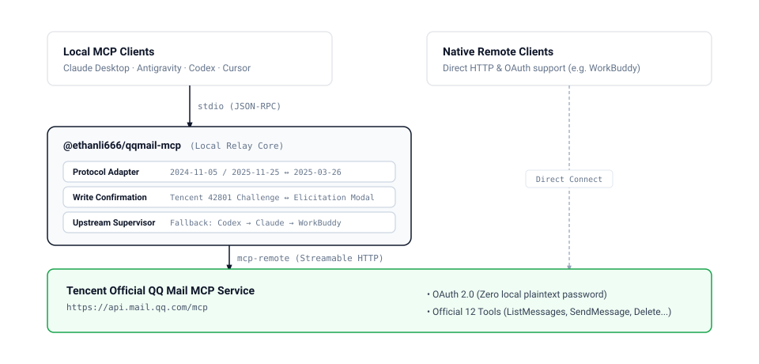

# QQ Mail MCP (@ethanli666/qqmail-mcp)

[中文说明](README.zh-CN.md)

A lightweight local adapter and stdio relay connecting MCP clients to Tencent's official QQ Mail Remote MCP service (`https://api.mail.qq.com/mcp`).

Starting with version 2.0, this project completely eliminates legacy IMAP/SMTP password access. Users never store plaintext mailbox passwords or authorization codes locally. All authentication is delegated to Tencent's official OAuth 2.0 web and mobile QR code authorization.

Designed specifically for local MCP clients such as Claude Desktop, Google Antigravity, Cursor, and Codex, with built-in protocol adaptation, candidate fallback rotation, and two-phase write confirmation safety.

---

## Architecture



---

## Quick Configuration

### 1. Local Stdio Clients (Recommended: Claude Desktop, Antigravity, Cursor)

Add the relay to your client's MCP configuration file (e.g., `claude_desktop_config.json` or `mcp_config.json`):

```json
{
  "mcpServers": {
    "qq-mail": {
      "command": "npx",
      "args": ["-y", "@ethanli666/qqmail-mcp@latest"]
    }
  }
}
```

Or print a generic configuration block using the CLI:
```bash
npx -y @ethanli666/qqmail-mcp --print-config
```

### 2. Native Remote OAuth Clients

If your host natively supports Streamable HTTP endpoints and browser OAuth flows, connect directly to Tencent's official service:

- **Codex CLI**:
  ```bash
  codex mcp add qqmail --url https://api.mail.qq.com/mcp
  codex mcp login qqmail --scopes alias:read,mail:read,mail:send,mail:delete
  ```
- **Claude Code**:
  ```bash
  claude mcp add --transport http qq-mail https://api.mail.qq.com/mcp
  ```
- **WorkBuddy or Connectors**:
  Reference [`mcp.json`](mcp.json) directly.

---

## First-Time Setup & QR Code Authorization

Follow these simple steps on your first run. Once authorized, credentials are saved locally for silent subsequent usage.

### Authorization Workflow

1. **Trigger the Connection**:
   - Restart your MCP host (such as Claude Desktop), or ask the AI agent a mail-related question (e.g., "List my last 5 emails").
   - You can also test the login in advance directly in your terminal: `npx -y @ethanli666/qqmail-mcp`.

2. **Browser Opens Automatically**:
   - The relay automatically opens your default web browser to Tencent's official OAuth authorization page (using local callback port `39300` by default).
   - If the browser does not pop up automatically, copy the URL displayed in the terminal or client logs.

3. **Scan QR Code with Mobile QQ**:
   - The webpage will display "QQ Mail Agent Login Authorization".
   - Open Mobile QQ on your phone, use the "Scan" feature in the upper-right corner to scan the QR code on screen (or log in via your QQ account on the page).
   - Check the requested scopes (read aliases, read messages, send messages, delete messages) and tap **Confirm Authorization**.

4. **Completed & Silently Cached**:
   - The webpage confirms successful authorization, and you can close the browser tab.
   - The relay automatically caches the OAuth token under `~/.qqmail-mcp/` (directory permission `0700`, token permission `0600`).
   - **One-time authorization**: Subsequent client restarts and agent conversations reuse the stored token without requiring you to scan again.

---

## Features & Official Tools

Tencent official service exposes 12 mailbox management tools:

| Tool | Type | Description |
| --- | --- | --- |
| `GetMe` | Read | Retrieves authorized mailbox aliases, active scopes, limits, and attachment size rules |
| `ListMessages` | Read | Lists and filters messages in inbox, sent, drafts, trash, or spam |
| `GetMessage` | Read | Retrieves full message body (HTML and plain text) with metadata |
| `SearchMessages` | Read | Searches messages by keyword, sender, recipient, date, or folder |
| `ListAttachments` | Read | Lists attachment metadata and sizes for a message |
| `DownloadAttachment` | Read | Downloads Base64 encoded attachment content |
| `SendMessage` | Write | Composes and sends an email (requires user confirmation) |
| `ReplyMessage` | Write | Replies to an existing message (requires user confirmation) |
| `ForwardMessage` | Write | Forwards a message to recipients (requires user confirmation) |
| `DeleteMessage` | Write | Moves a message to the trash folder (requires user confirmation) |
| `PermanentDeleteMessage` | Write | Permanently deletes a message with no recovery (requires user confirmation) |
| `ClearTrash` | Write | Clears all messages in the trash folder (requires user confirmation) |

> Tool definitions, arguments, and schemas are returned dynamically by Tencent at runtime. This package does not alter or re-implement any tool.

---

## Safety & Two-Phase Confirmation

### 1. Zero Local Passwords
No mailbox passwords or authorization codes are ever stored, processed, or transmitted by this package. All tokens are minted directly by Tencent OAuth.

### 2. Two-Phase Write Safety (Elicitation)
To prevent accidental actions or hallucinations by AI agents, Tencent enforces a two-phase challenge on write operations:
- When an agent first invokes a write tool (such as `SendMessage`, `DeleteMessage`, or `ClearTrash`), Tencent returns error code `42801` containing an operation summary and a single-use token.
- This relay intercepts the challenge and displays an interactive confirmation dialog (via standard MCP `elicitation/create`).
- Only when the user inspects and confirms the action does the relay replay the call with the confirmation token. If declined or expired after 5 minutes, the operation is blocked.

---

## Environment Variables

| Variable | Default | Purpose |
| --- | --- | --- |
| `QQMAIL_OAUTH_CLIENT_NAME` | Auto-detect | Forces a verified client name (`Codex`, `Claude`, `WorkBuddy`) |
| `QQMAIL_OAUTH_CALLBACK_PORT` | `39300` | Sets a fixed local port for OAuth redirects if conflicts occur |
| `MCP_REMOTE_CONFIG_DIR` | `~/.qqmail-mcp` | Customizes local OAuth state directory |

---

## Migrating from 1.x

Version 1.x relied on `QQMAIL_USER`, `QQMAIL_PASS`, and direct IMAP connections. Version 2.x removes all IMAP support.
- If `QQMAIL_USER` or `QQMAIL_PASS` are detected in your environment, the relay halts immediately to avoid credential leakage.
- Remove legacy credentials from your client config and use the stdio configuration above.

---

## Development

```bash
npm install
npm test
npm pack --dry-run
```

---

## Disclaimer

This repository is an independent open-source connector. QQ Mail, the remote MCP service, and related trademarks are owned by Tencent.
